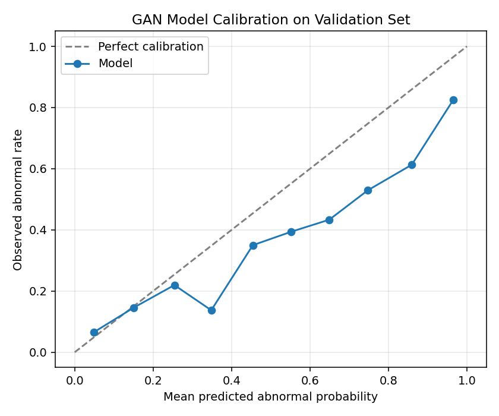
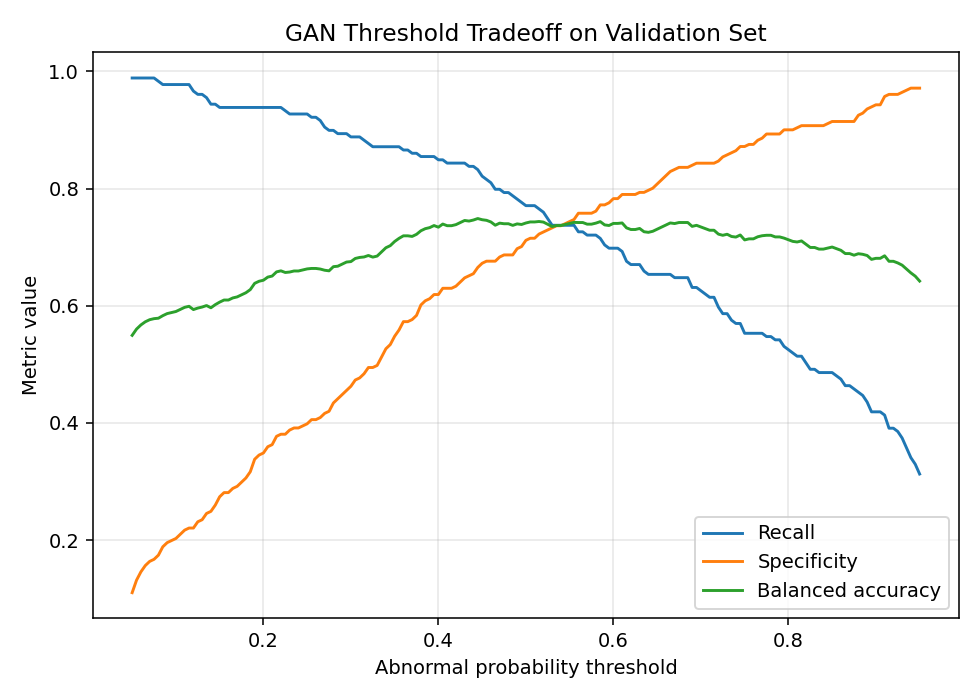

# Research Report: Heart Sound Screening Assistant

## Executive Summary
This report evaluates a research **screening assistant, not a diagnosis system**, for classifying Phonocardiogram (PCG) recordings from the **PhysioNet Heart Sound Dataset (CinC Challenge 2016)**. The project compares a baseline model with a GAN-augmented model and uses validation-selected thresholds instead of assuming a fixed 0.5 cutoff.

---

## Prevent Data Leakage validation Check
To reduce leakage risk, a recording-level split was implemented *before* signal segmentation. The overlap validation check verified:
* **Overlapping recordings between splits**: 0 files.
* **Leak-proof splitting**: Successful.

---

## Quantitative Performance Comparison

| Model | Threshold | Accuracy | Balanced Accuracy | Precision | Recall | Specificity | NPV | F1-score | AUC |
| :--- | :--- | :--- | :--- | :--- | :--- | :--- | :--- | :--- | :--- |
| **Baseline (No GAN)** | 0.335 | 0.4947 | 0.5639 | 0.4431 | 0.9372 | 0.1906 | 0.8154 | 0.6017 | 0.6422 |
| **GAN-Augmented** | 0.270 | 0.5565 | 0.6210 | 0.4780 | 0.9686 | 0.2734 | 0.9268 | 0.6401 | 0.7640 |

The thresholds above are selected on the validation split, not guessed at 0.5.
Predictions close to the selected threshold should be treated as **Uncertain**
and reviewed by a clinician.

### Calibration and Threshold Safety
The following plots are generated to inspect confidence quality and threshold tradeoffs:

### Relative Improvements:
* **Accuracy Improvement**: +6.18%
* **Recall (Sensitivity) Improvement**: +3.14%
* **F1-score Improvement**: +3.85%
* **AUC Score Improvement**: +12.18%

---

## GAN Validation Analysis

### 1. t-SNE Feature Space Distribution
t-SNE dimensionality reduction (from 2496 dimensions to 2D) was applied to the abnormal training features (real vs. synthetic). The plot demonstrates:
* The synthetic features overlap substantially with the real features, indicating that the GAN has successfully captured the underlying feature space distribution of abnormal Phonocardiogram signals.
* There is no severe mode collapse, showing that the synthetic samples cover the variations in the real data.

### 2. Statistical Similarity
We compared the distribution statistics of the combined MFCC + log-mel features:
* **Real Abnormal Means (average)**: 0.1261 (Variance: 0.0280)
* **Generated Abnormal Means (average)**: 0.1364 (Variance: 0.0397)
* **Average Spectral Centroid (MFCC-index equivalent)**:
  * Real Abnormal: Coefficient -14.23
  * Generated Abnormal: Coefficient -7.59

The similarity in mean, variance, and centroid values indicates high statistical fidelity of the synthetic MFCCs.

### 3. Visual Feature Comparison (MFCC Heatmaps)
The following plot shows a side-by-side comparison of a Real Normal, Real Abnormal, and GAN Synthetic Abnormal MFCC heatmap. 

---

## Visual Model Comparisons

### Confusion Matrices
Below are the confusion matrices for both model configurations. Note how the GAN-Augmented model manages class classifications:

### ROC Curves & Training Histories
The ROC curve comparison and training curve comparisons are illustrated below:

---

## Final Conclusions
1. **Augmentation Benefit**: The GAN-augmented model **improved** overall classification performance.
2. **Most Improved Metric**: The metric that showed the largest improvement was **AUC Score** (with a change of **+12.18%**).
3. **Fidelity of Synthesis**: The generated feature samples appear realistic both visually (showing similar bands and temporal transitions in heatmaps) and mathematically (exhibiting statistical similarity and feature space overlap in t-SNE).
4. **Clinical Safety Note**: This model is a research screening demo. It is not perfect, not medically certified, and must not be used as a stand-alone diagnosis. It should support, not replace, clinician review.
