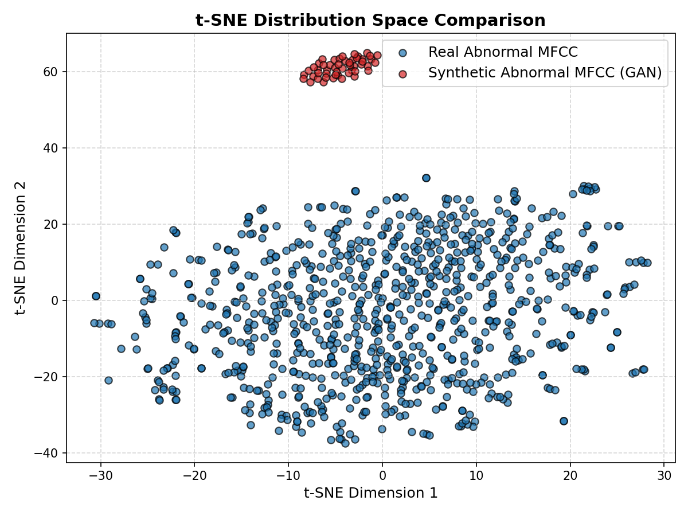
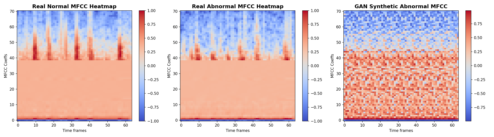
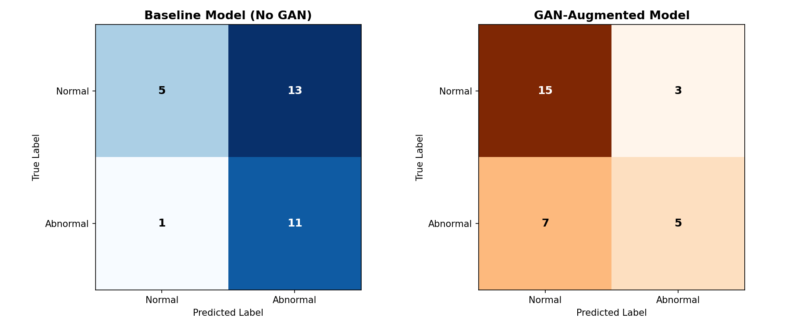
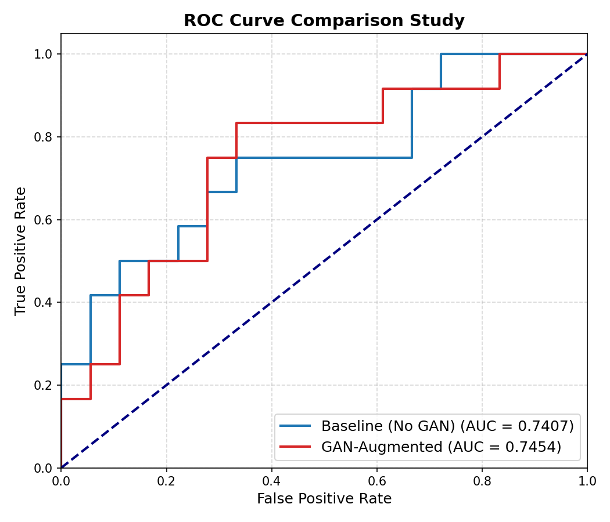
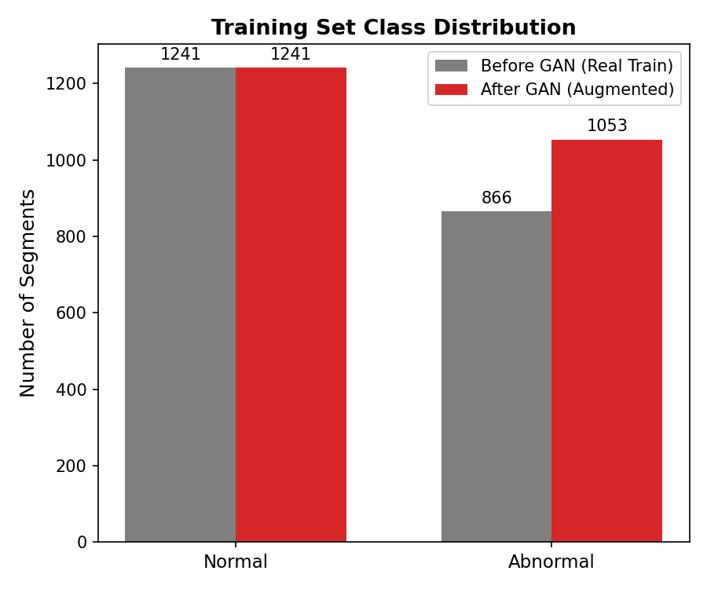

# Research Report: Heart Sound Screening Assistant

## Executive Summary
This report evaluates a research **screening assistant, not a diagnosis system**, for classifying Phonocardiogram (PCG) recordings from the **PhysioNet Heart Sound Dataset (CinC Challenge 2016)**. The project compares a baseline model with a GAN-augmented model and uses validation-selected thresholds instead of assuming a fixed 0.5 cutoff.

---

## Prevent Data Leakage validation Check
To reduce leakage risk, a recording-level split was implemented *before* signal segmentation. The overlap validation check verified:
* **Overlapping recordings between splits**: 0 files.
* **Leak-proof splitting**: Successful.

---

## Recording-Level Performance Comparison

Each recording is evaluated once by averaging its segment probabilities. This matches how `predict.py` handles one uploaded WAV file.

| Model | Threshold | Accuracy | Balanced Accuracy | Precision | Recall | Specificity | NPV | F1-score | AUC |
| :--- | :--- | :--- | :--- | :--- | :--- | :--- | :--- | :--- | :--- |
| **Baseline (No GAN)** | 0.640 | 0.5333 | 0.5972 | 0.4583 | 0.9167 | 0.2778 | 0.8333 | 0.6111 | 0.7407 |
| **GAN-Augmented** | 0.320 | 0.6667 | 0.6250 | 0.6250 | 0.4167 | 0.8333 | 0.6818 | 0.5000 | 0.7454 |

The thresholds above are selected on the validation split, not guessed at 0.5.
Predictions close to the selected threshold should be treated as **Uncertain**
and reviewed by a clinician.

### Calibration and Threshold Safety
The following plots are generated to inspect confidence quality and threshold tradeoffs:

### Relative Improvements:
* **Accuracy Improvement**: +13.33%
* **Recall (Sensitivity) Improvement**: -50.00%
* **F1-score Improvement**: -11.11%
* **AUC Score Improvement**: +0.46%

---

## GAN Validation Analysis

### 1. t-SNE Feature Space Distribution
t-SNE dimensionality reduction (from 2496 dimensions to 2D) was applied to the abnormal training features (real vs. synthetic). The plot demonstrates:
* The plot is a visual sanity check only; it is not proof of clinical quality.
* If synthetic points are far away from real points, the GAN should be treated carefully or disabled for the final classifier.

### 2. Statistical Similarity
We compared the distribution statistics of the combined MFCC + log-mel features:
* **Real Abnormal Means (average)**: 0.1261 (Variance: 0.0280)
* **Generated Abnormal Means (average)**: 0.1322 (Variance: 0.0576)
* **Average Spectral Centroid (MFCC-index equivalent)**:
  * Real Abnormal: Coefficient -14.23
  * Generated Abnormal: Coefficient -10.95

These statistics are useful checks, but classifier performance and validation/test metrics are more important than visual similarity alone.

### 3. Visual Feature Comparison (MFCC Heatmaps)
The following plot shows a side-by-side comparison of a Real Normal, Real Abnormal, and GAN Synthetic Abnormal MFCC heatmap. 

---

## Visual Model Comparisons

### Confusion Matrices
Below are the confusion matrices for both model configurations. Note how the GAN-Augmented model manages class classifications:

### ROC Curves & Training Histories
The ROC curve comparison and training curve comparisons are illustrated below:

---

## Final Conclusions
1. **GAN Result**: GAN augmentation reduced false positives and improved accuracy, but it missed more abnormal cases than the baseline screening model.
2. **Best balanced setting**: Use **Baseline** in **specificity** mode when you want the best balance of recall and specificity. Test balanced accuracy = **0.7083**.
3. **To reduce false positives**: Use **GAN-Augmented** in **screening** mode. Test specificity = **0.8333**, recall = **0.4167**.
4. **Clinical Safety Note**: This project is a research screening assistant, not a diagnosis system. It is not perfect, not medically certified, and must not be used as a stand-alone medical decision tool.
